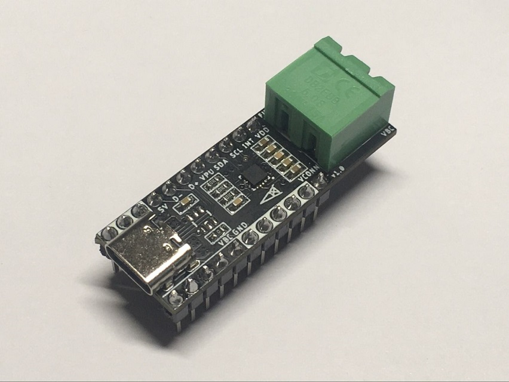
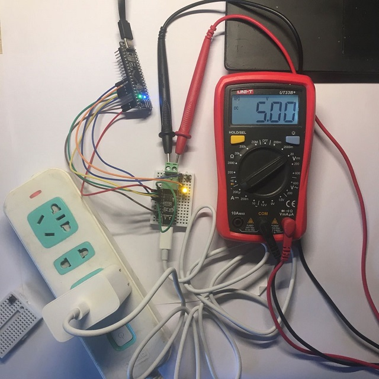
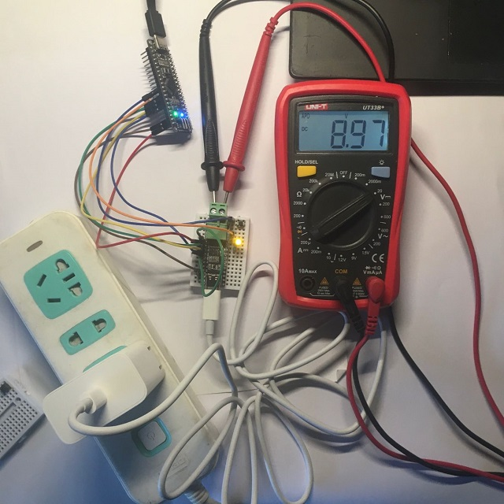
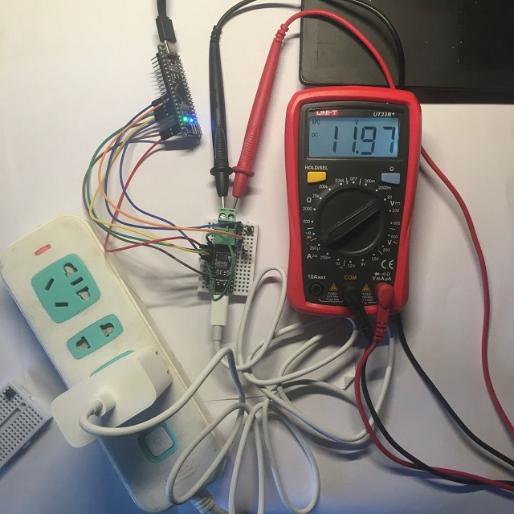
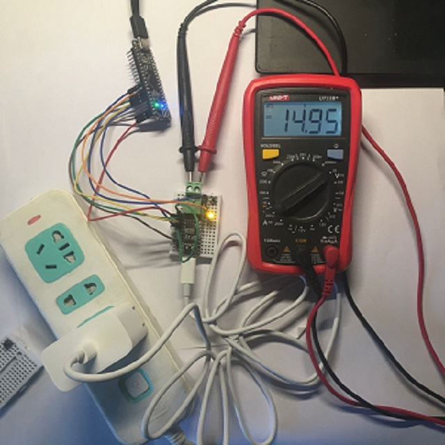
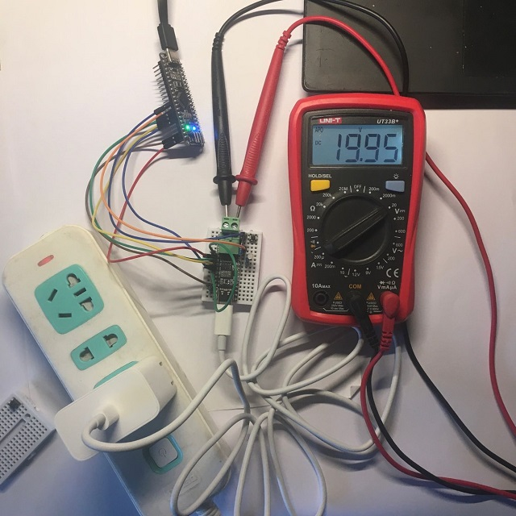

# FUSB302B-Breakout

## PCB

## Schematic

## B.O.M

 please see bom/ibom.html

## Relevant code

### Where does the code come from?

The code comes from the example of [Reclaimer Labs](https://www.reclaimerlabs.com/) shared by [GreatScott!](https://www.instructables.com/member/GreatScottLab/)

For more details, please see:

- DIY_USB_Type-C_Power_Delivery_Trigger_Board](https://www.instructables.com/DIY-USB-Type-C-Power-Delivery-Trigger-Board/)
- [usb-c-arduino---graycatlabs](https://github.com/graycatlabs/usb-c-arduino)
- [USB-C-Explorer---ReclaimerLabs](https://github.com/ReclaimerLabs/USB-C-Explorer)

### Can I run this code on Arduino uno, nano, micro or leonardo?

No, they don't have enough SRAM(only 2KB)，It is recommended to use a processor with SRAM of 4KB and above

### How can I run this code with stm32 on arduino ide？

Well, please see [Arduino_Core_STM32](https://github.com/stm32duino/Arduino_Core_STM32)

### E.g. MCU

In theory, all MCUs supported by stm32duino support.

| MCU           | SRAM  | Has it been tested？ |
| ------------- | ----- | -------------------- |
| STM32F030F4P6 | 4KB   | :yellow_heart:       |
| STM32F072CBT6 | 16KB  | 💚                    |
| STM32F103C8T6 | 20KB  | :yellow_heart:       |
| ...           | ...   | ...                  |
| ESP8266       | 32KB? | 💚                    |

## Pictures

- The smallest system board used in the test is based on STM32F072CBT6, for more details, please see: [DarkPill](https://github.com/oldgerman/DarkPill)
- The PD charger used in test is XiaoMi AD651(65W), [report of disassembly](http://www.chongdiantou.com/wp/archives/46359.html)

<table>
    <td>
    <td>
    <td>
</table>

<table>
    <td>
    <td>
    <td>
</table>

## Acknowledgments

-  [GreatScott!](https://www.instructables.com/member/GreatScottLab/)
-  [Reclaimer Labs](https://www.reclaimerlabs.com/) 
- [STM32duino](https://github.com/stm32duino)

